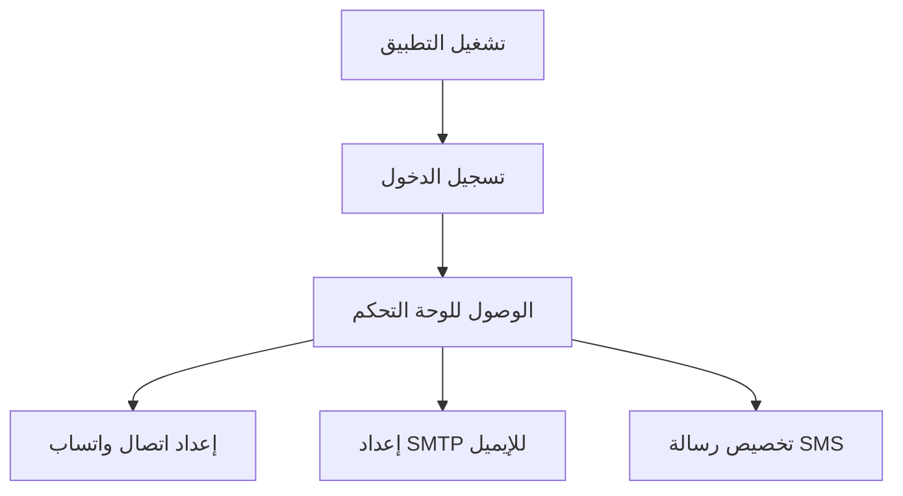
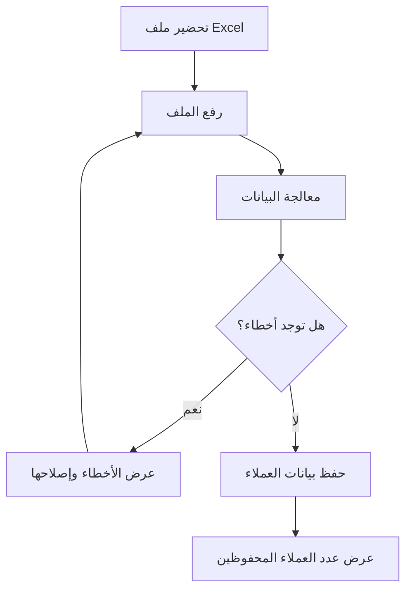
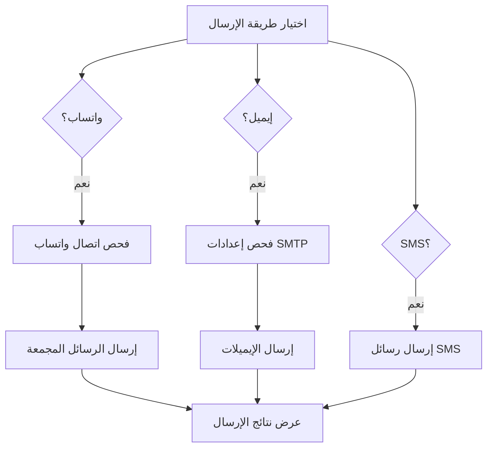
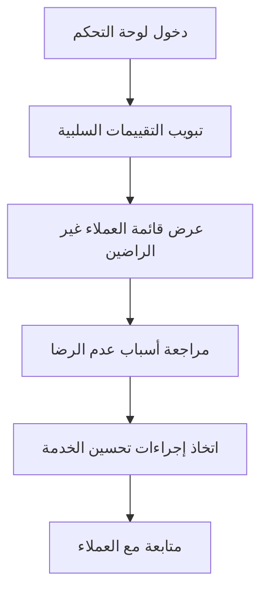

# 📋 دليل نظام أتمتة تقييمات العملاء - الشرح الشامل

## 📖 فهرس المحتويات

1. [نظرة عامة على النظام](#نظرة-عامة)
2. [هيكل المشروع](#هيكل-المشروع)
3. [الواجهة الأمامية (Frontend)](#الواجهة-الأمامية)
4. [الخادم الخلفي (Backend)](#الخادم-الخلفي)
5. [قاعدة البيانات](#قاعدة-البيانات)
6. [خدمات النظام](#خدمات-النظام)
7. [واجهات برمجة التطبيقات (APIs)](#واجهات-برمجة-التطبيقات)
8. [تدفق العمل الكامل](#تدفق-العمل-الكامل)
9. [الاستخدام العملي](#الاستخدام-العملي)
10. [المشاكل ��لشائعة وحلولها](#المشاكل-الشائعة)

---

## 🔍 نظرة عامة على النظام {#نظرة-عامة}

### الهدف الرئيسي

نظام أتمتة تقييمات العملاء هو منصة متكاملة تتيح للمؤسسات إرسال رسائل مخصصة لعملائها عبر قنوات متعددة (واتساب، إيميل، SMS) لجمع تقييماتهم وتحليلها تلقائياً.

### المميزات الأساسية

- ✅ **إرسال رسائل متعددة القنوات**: واتساب، إيميل، SMS
- ✅ **معالجة تلقائية للردود**: تحليل التقييمات وتصنيفها
- ✅ **ردود ذكية**: استجابات مختلفة حسب درجة التقييم
- ✅ **إدارة بيانات العملاء**: رفع ومعالجة ملفات Excel
- ✅ **لوحة تحكم شاملة**: إعدادات ومتابعة التقييمات
- ✅ **واجهة عربية**: دعم كامل للغة العربية واتجاه RTL

### التقنيات المستخدمة

| المكون           | التقنية                              |
| ---------------- | ------------------------------------ |
| الواجهة الأمامية | React 18 + TypeScript + Tailwind CSS |
| الخادم الخلفي    | Node.js + Express.js                 |
| قاعدة البيانات   | MongoDB + Mongoose                   |
| إرسال واتساب     | whatsapp-web.js                      |
| إرسال الإيميل    | Nodemailer                           |
| معالجة Excel     | XLSX                                 |
| رفع الملفات      | Multer                               |

---

## 🏗️ هيكل المشروع {#هيكل-المشروع}

```
feedback-automation-platform/
├── client/                     # الواجهة الأمامية
│   ├── components/ui/          # مكونات الواجهة
│   ├── hooks/                  # React Hooks
│   ├── pages/                  # صفحات التطبيق
│   ├── lib/                    # مكتبات مساعدة
│   ├── App.tsx                 # نقطة دخول التطبيق
│   └── global.css              # أنماط عامة
├── server/                     # الخادم الخلفي
│   ├── config/                 # إعدادات الاتصال
│   ├── models/                 # نماذج قاعدة البيانات
│   ├── routes/                 # مسارات API
│   ├── services/               # خدمات الأعمال
│   └── index.ts                # نقطة دخول الخادم
├── shared/                     # أنواع البيانات المشتركة
├── uploads/                    # ملفات العملاء المرفوعة
├── .env                        # متغيرات البيئة
└── package.json                # إعدادات المشروع
```

---

## 🎨 الواجهة الأمامية (Frontend) {#الواجهة-الأمامية}

### الصفحات الرئيسية

#### 1. الصفحة الرئيسية (`client/pages/Index.tsx`)

```typescript
// الوظائف الأساسية:
- عرض مميزات النظام
- شرح كيفية عمل المنصة
- روابط التنقل للصفحات الأخرى
- تصميم عربي احترافي مع RTL
```

#### 2. صفحة تسجيل الدخول (`client/pages/Login.tsx`)

```typescript
// بيانات الدخول الثابتة:
Email: "Mohamed2025@gmail.com"
Password: "Mohamed@2025"

// الوظائف:
- تسجيل دخول بالبيانات المحددة
- التحقق من صحة البيانات
- توجيه إلى لوحة التحكم عند النجاح
- حفظ حالة المصادقة في localStorage
```

#### 3. لوحة التحكم (`client/pages/Dashboard.tsx`)

**الأقسام الأربعة الرئيسية:**

##### أ) إعداد الاتصال

```typescript
// ربط واتساب:
- عرض QR Code للربط
- تتبع حالة الاتصال (جاهز، منتظر، منقطع)
- إعادة تهيئة الاتصال

// إعدادات SMTP:
- البريد الإلكتروني المرسل
- كلمة مرور التطبيق
- خادم SMTP والمنفذ
- اختبار الاتصال
```

##### ب) إعداد الرسائل

```typescript
// قوالب الرسائل المختلفة:
- واتساب: رسالة بالنجوم للتقييم
- إيميل: قالب HTML تفاعلي
- SMS: رسالة نصية مخصصة

// إمكانية تعديل رسالة SMS
```

##### ج) إرسال التقييمات

```typescript
// رفع ملف Excel:
- قراءة أرقام الهواتف (عمود A)
- قراءة الإيميلات (عمود B)
- قراءة الأسماء (عمود C - اختياري)
- التحقق من صحة البيانات

// أزرار الإرسال:
- إرسال عبر واتساب (يتطلب اتصال نشط)
- إرسال عبر الإيميل (يتطلب إعداد SMTP)
- إرسال عبر SMS (قيد التطوير)
```

##### د) التقييمات السلبية

```typescript
// عرض التقييمات < 4:
- اسم العميل ورقم الهاتف
- درجة التقييم بالنجوم
- سبب عدم الرضا
- مصدر التقييم (واتساب/إيميل/SMS)
- تاريخ التقييم
```

### نظام التوجيه والحماية

```typescript
// ProtectedRoute Component:
- فحص حالة المصادقة من localStorage
- إعادة توجيه غير المسجلين إلى صفحة الدخول
- عرض شاشة تحميل أثناء التحقق
```

---

## ⚙️ الخادم الخلفي (Backend) {#الخادم-الخلفي}

### نقطة الدخول (`server/index.ts`)

```typescript
// الإعدادات الأساسية:
- اتصال قاعدة البيانات
- إعداد CORS للواجهة الأمامية
- معالجة JSON وملفات مرفوعة
- تسجيل جميع مسارات API
- معالجة الأخطاء المركزية
```

### إعداد قاعدة البيانات (`server/config/database.ts`)

```typescript
// إدارة الاتصال:
async function connectDB() {
  // محاولة الاتصال بـ MongoDB
  // في حالة الفشل: استخدام التخزين المؤقت
  // عدم إيقاف التطبيق عند فقدان قاعدة البيانات
}
```

---

## 🗄️ قاعدة البيانات {#قاعدة-البيانات}

### النماذج الأساسية (`server/models/index.ts`)

#### 1. نموذج الإعدادات (Settings)

```typescript
interface Settings {
  whatsappConnected: boolean; // حالة اتصال واتساب
  smtpConfig: {
    // إعدادات البريد
    email: string;
    password: string;
    host: string;
    port: number;
  };
  smsMessage: string; // رسالة SMS المخصصة
  createdAt: Date;
  updatedAt: Date;
}
```

#### 2. نموذج العملاء (Customer)

```typescript
interface Customer {
  _id: string;
  name?: string; // اسم العميل (اختياري)
  phone: string; // رقم الهاتف (مطلوب وفريد)
  email?: string; // البريد الإلكتروني (اختياري)
  createdAt: Date;
  updatedAt: Date;
}
```

#### 3. نموذج التقييمات (Feedback)

```typescript
interface Feedback {
  _id: string;
  customerId: string; // معرف العميل
  customerPhone: string; // رقم هاتف العميل
  customerName?: string; // اسم العميل
  rating: number; // التقييم (1-5)
  reason?: string; // سبب عدم الرضا (للتقييمات السلبية)
  source: "whatsapp" | "email" | "sms"; // مصدر التقييم
  status: "pending" | "processed"; // حالة المعالجة
  createdAt: Date;
  updatedAt: Date;
}
```

### الت��زين المؤقت (`server/services/mockStorage.ts`)

```typescript
// يُستخدم عند عدم توفر MongoDB:
class MockStorage {
  // تخزين الإعدادات في الذاكرة
  // إدارة بيانات العملاء
  // حفظ التقييمات المؤقتة
  // بيانات تجريبية للتقييمات السلبية
}
```

---

## 🔧 خدمات النظام {#خدمات-النظام}

### 1. خدمة واتساب (`server/services/whatsapp.ts`)

#### التهيئة والاتصال

```typescript
class WhatsAppService {
  // إنشاء عميل واتساب
  async initialize() {
    // إعداد Puppeteer للتحكم في المتصفح
    // إنشاء QR Code للربط
    // تسجيل معالجات الأحداث
  }

  // حالات الاتصال المختلفة
  private botStatus:
    | "not_initialized" // لم يتم التهيئة
    | "initializing" // جاري التهيئة
    | "waiting_for_qr_scan" // انتظار مسح QR
    | "ready" // جاهز للاستخدام
    | "disconnected" // منقطع
    | "auth_failed"; // فشل في المصادقة
}
```

#### معالجة الرسائل الواردة

```typescript
// عند استقبال رسالة:
async handleMessage(msg) {
  // تجاهل رسائل الجروبات والحالات
  // تجاهل الرسائل المرسلة من البوت نفسه

  // استخراج التقييم من النص (1-5)
  const rating = extractRating(messageText);

  if (rating) {
    await handleRating(customerPhone, rating);
  } else {
    await handleFollowUpReason(customerPhone, messageText);
  }
}
```

#### المعالجة الذكية للتقييمات

```typescript
// للتقييمات الإيجابية (4-5 نجوم):
async handlePositiveRating() {
  const response = `شكرًا لتقييمك الرائع! 🌟
هل يمكنك ترك تقييم عام على Google Maps؟
[رابط Google Maps]`;

  await sendMessage(customerPhone, response);
  // تعيين حالة "تم المعالجة"
}

// للتقييمات السلبية (1-3 نجوم):
async handleNegativeRating() {
  const response = `شكرًا لصراحتك 🙏
يهمنا نعرف سبب عدم رضاك.
ممكن توضح لنا إيه اللي مش عاجبك؟`;

  await sendMessage(customerPhone, response);
  // انتظار الرد بالسبب
}
```

#### الإرسال المجمع

```typescript
async sendBulkMessages(customers) {
  const template = `إحنا سعداء جداً إنك شرفتنا النهار��ه ❤️
يهمنا تقييمك لزيارتك:
⭐️ ⭐️ ⭐️ ⭐️ ⭐️
من فضلك اختار تقييمك بالرد على الرسالة.`;

  // إرسال لكل عميل مع تأخير لتجنب الحظر
  for (const customer of customers) {
    await sendMessage(customer.phone, template);
    await delay(1000); // تأخير ثانية واحدة
  }
}
```

### 2. خدمة البريد الإلكتروني (`server/services/email.ts`)

#### إعداد SMTP

```typescript
class EmailService {
  async initialize() {
    // قراءة إعدادات SMTP من قاعدة البيانات
    this.transporter = nodemailer.createTransporter({
      host: settings.smtpConfig.host,
      port: settings.smtpConfig.port,
      secure: port === 465,
      auth: {
        user: settings.smtpConfig.email,
        pass: settings.smtpConfig.password,
      },
    });

    // اختبار الاتصال
    await this.transporter.verify();
  }
}
```

#### قالب الإيميل

```html
<!-- قالب HTML متجاوب مع RTL -->
<!DOCTYPE html>
<html dir="rtl" lang="ar">
  <head>
    <meta charset="UTF-8" />
    <style>
      body {
        font-family: "Cairo", Arial, sans-serif;
      }
      .rating-star {
        font-size: 40px;
        color: #fbbf24;
        cursor: pointer;
      }
    </style>
  </head>
  <body>
    <div class="container">
      <h1>🙏 أهلاً بك!</h1>
      <p>سعداء جداً إنك زرت فرعنا النهارده ❤️</p>

      <!-- نجوم تفاعلية للتقييم -->
      <div class="rating-container">
        <a href="mailto:feedback@company.com?subject=تقييم-1">⭐️</a>
        <a href="mailto:feedback@company.com?subject=تقييم-2">⭐️</a>
        <a href="mailto:feedback@company.com?subject=تقييم-3">⭐️</a>
        <a href="mailto:feedback@company.com?subject=تقييم-4">⭐️</a>
        <a href="mailto:feedback@company.com?subject=تقييم-5">⭐️</a>
      </div>
    </div>
  </body>
</html>
```

### 3. خدمة رفع الملفات (`server/services/fileUpload.ts`)

#### معالجة ملفات Excel

```typescript
class FileUploadService {
  async processExcelFile(filePath: string) {
    // قراءة ملف Excel
    const workbook = XLSX.readFile(filePath);
    const worksheet = workbook.Sheets[workbook.SheetNames[0]];

    // تحويل إلى JSON
    const jsonData = XLSX.utils.sheet_to_json(worksheet, { header: 1 });

    // معالجة كل صف
    for (let i = 1; i < jsonData.length; i++) {
      const row = jsonData[i];

      const phone = cleanPhoneNumber(row[0]); // عمود A
      const email = row[1]?.trim(); // عمود B
      const name = row[2]?.trim(); // عمود C

      // التحقق من صحة البيانات
      if (!phone) {
        errors.push(`الصف ${i + 1}: رقم هاتف غير صالح`);
        continue;
      }

      if (email && !isValidEmail(email)) {
        errors.push(`الصف ${i + 1}: إيميل غير صالح`);
      }

      // إضافة العميل
      customers.push({ phone, email, name });
    }

    // حفظ في قاعدة البيانات أو التخزين المؤقت
    return saveCustomers(customers);
  }
}
```

#### تنظيف أرقام الهواتف

```typescript
private cleanPhoneNumber(phone: any): string | null {
  if (!phone) return null;

  // إزالة كل شيء عدا الأرقام
  let cleanPhone = String(phone).replace(/\D/g, '');

  // معالجة الأرقام المصرية
  if (cleanPhone.startsWith('20')) {
    cleanPhone = cleanPhone.substring(2);
  }

  // إضافة كود البلد للأرقام المصرية
  if (cleanPhone.startsWith('01') && cleanPhone.length === 11) {
    cleanPhone = '20' + cleanPhone;
  }

  // التحقق من الطول
  if (cleanPhone.length < 10 || cleanPhone.length > 15) {
    return null;
  }

  return cleanPhone;
}
```

---

## 🌐 واجهات برمجة التطبيقات (APIs) {#واجهات-برمجة-التطبيقات}

### 1. مسارات واتساب (`/api/whatsapp/*`)

```typescript
// GET /api/whatsapp/status
// الحصول على حالة واتساب الحالية
Response: {
  status: "ready" | "waiting_for_qr_scan" | "disconnected",
  qrCode?: "data:image/png;base64,..." // عند الحاجة للربط,
  message: "WhatsApp جاهز للاستخدام"
}

// POST /api/whatsapp/initialize
// تهيئة اتصال واتساب جديد
Response: {
  success: true,
  status: { ... }
}

// POST /api/whatsapp/send-bulk
// إرسال رسائل جماعية
Request: {
  customers: [
    { phone: "+201234567890", name: "أحمد محمد" }
  ]
}
Response: {
  success: true,
  sent: 5,
  failed: 1,
  errors: ["فشل في إرسال رسالة إلى +201234567890"]
}
```

### 2. مسارات الإعدادات (`/api/settings/*`)

```typescript
// GET /api/settings
// الحصول على جميع الإعدادات
Response: {
  whatsappConnected: false,
  smtpConfig: {
    email: "test@gmail.com",
    password: "***", // مخفية لأمان
    host: "smtp.gmail.com",
    port: 587
  },
  smsMessage: "من فضلك قيم زيارتك..."
}

// PUT /api/settings/smtp
// تحديث إعدادات البريد الإلكتروني
Request: {
  email: "myemail@gmail.com",
  password: "app_password",
  host: "smtp.gmail.com",
  port: 587
}

// PUT /api/settings/sms-message
// تحديث رسالة SMS
Request: {
  message: "رسالة SMS المخصصة الجديدة"
}
```

### 3. مسارات العملاء (`/api/customers/*`)

```typescript
// GET /api/customers
// الحصول على قائمة العملاء مع Pagination
Query: ?page=1&limit=50
Response: {
  customers: [...],
  pagination: {
    page: 1,
    limit: 50,
    total: 150,
    pages: 3
  }
}

// POST /api/customers/upload
// رفع ملف Excel للعملاء
Content-Type: multipart/form-data
File: Excel file (.xlsx, .xls)
Response: {
  success: true,
  customers: [...], // العملاء المحفوظون
  errors: ["الصف 5: رقم هاتف غير صالح"]
}

// POST /api/customers/send-whatsapp
// إرسال رسائل واتساب للعملاء المحددين
Request: {
  customerIds: ["67890", "67891"]
}

// POST /api/customers/send-email
// إرسال إيميلات للعملاء المحددين
Request: {
  customerIds: ["67890", "67891"]
}
```

### 4. مسارات التقييمات (`/api/feedback/*`)

```typescript
// GET /api/feedback/negative
// الحصول على التقييمات السلبية فقط
Response: {
  feedback: [
    {
      _id: "...",
      customerPhone: "+201234567890",
      customerName: "أحمد محمد",
      rating: 2,
      reason: "الخدمة بطيئة جداً",
      source: "whatsapp",
      createdAt: "2024-01-01T10:00:00Z"
    }
  ],
  pagination: { ... }
}

// GET /api/feedback/stats
// إحصائيات التقييمات
Response: {
  total: 100,
  positive: 75, // تقييمات >= 4
  negative: 25, // تقييمات < 4
  averageRating: 4.2,
  bySource: [
    { _id: "whatsapp", count: 60 },
    { _id: "email", count: 40 }
  ]
}

// POST /api/feedback
// إضافة تقييم يدوياً (للاختبار)
Request: {
  customerPhone: "+201234567890",
  rating: 3,
  reason: "الخدمة عادية",
  source: "manual"
}
```

### 5. مسار المصادقة (`/api/auth/*`)

```typescript
// POST /api/auth/login
// تسجيل الدخول بالبيانات الثابتة
Request: {
  email: "Mohamed2025@gmail.com",
  password: "Mohamed@2025"
}
Response: {
  success: true,
  message: "تم تسجيل الدخول بنجاح",
  user: {
    email: "Mohamed2025@gmail.com",
    name: "Mohamed"
  }
}
```

---

## 🔄 تدفق العمل الكامل {#تدفق-العمل-الكامل}

### 1. إعداد النظ��م الأولي



**الخطوات التفصيلية:**

1. **تشغيل النظام**

   ```bash
   npm install
   npm run dev
   ```

2. **تسجيل الدخول**

   - الانتقال إلى `/login`
   - إدخال البيانات: `Mohamed2025@gmail.com` / `Mohamed@2025`
   - النقر على "تسجيل الدخول"

3. **إعداد واتساب**

   - الانتقال لتبويب "إعداد الاتصال"
   - النقر على "تهيئة WhatsApp"
   - مسح QR Code بالهاتف
   - انتظار رسالة "تم الربط بنجاح"

4. **إعداد البريد الإلكتروني**
   - ملء بيانات SMTP (Gmail مثلاً)
   - استخدام App Password بدلاً من كلمة المرور العادية
   - النقر على "حفظ الإعدادات"

### 2. إضافة بيانات العملاء



**تنسيق ملف Excel المطلوب:**

```
| عمود A (مطلوب) | عمود B (اختياري) | عمود C (اختياري) |
|----------------|------------------|------------------|
| أرقام الهواتف   | عناوين الإيميل    | أسماء العملاء     |
| 01234567890    | ahmed@email.com  | أحمد محمد        |
| +201234567891  | fatma@email.com  | فاطمة علي        |
```

### 3. إرسال طلبات التقييم



### 4. معالجة ردود العملاء

```mermaid
graph TD
    A[استقبال رد العميل] --> B{ما نوع الرد؟}

    B -->|رقم 1-5| C[تقييم بالأ��قام]
    B -->|نجوم ⭐| D[تقييم بالنجوم]
    B -->|نص| E[سبب عدم الرضا]

    C --> F{التقييم >= 4؟}
    D --> F

    F -->|نعم| G[إرسال رسالة شكر + طلب مراجعة Google]
    F -->|لا| H[طلب توضيح سبب عدم الرضا]

    E --> I[حفظ السبب مع التقييم]
    I --> J[إرسال رسالة شكر للتوضيح]

    G --> K[تعيين حالة "تم المعالجة"]
    J --> K
    K --> L[عرض في لوحة التحكم]
```

**أمثلة على الردود المقبولة:**

- أرقام: `5`، `4`، `3`، `2`، `1`
- نجوم: `⭐⭐⭐⭐⭐`، `⭐⭐⭐`
- نصوص: أي نص يوضح سبب عدم الرضا

### 5. متابعة النتائج



---

## 💡 الاستخدام العملي {#الاستخدام-العملي}

### سيناريو كامل: مطعم يريد جمع تقييمات العملاء

#### الخطو�� 1: إعداد النظام

```typescript
// 1. تسجيل الدخول للوحة التحكم
// 2. ربط رقم واتساب المطعم بالنظام
// 3. إعداد إيميل المطعم للإرسال
// 4. تخصيص رسالة SMS بأسلوب المطعم
```

#### الخطوة 2: تحضير بيانات العملاء

```excel
// ملف Excel: customers_today.xlsx
| A (أرقام)      | B (إيميلات)        | C (أسماء)    |
|---------------|-------------------|-------------|
| 01012345678   | ahmed@gmail.com   | أحمد محمد    |
| 01112345679   | sara@yahoo.com    | سارة أحمد    |
| 01212345680   |                   | محمد علي    |
```

#### الخطوة 3: إرسال طلبات التقييم

```typescript
// رسالة واتساب التي سيتم إرسالها:
"مرحباً أحمد محمد 👋
شكراً لزيارتك مطعم الأصالة النهارده
يهمنا تقييمك لتجربتك معانا:
⭐⭐⭐⭐⭐
ابعتلنا تقييمك من 1 لـ 5 نجوم"

// النتيجة المتوقعة:
// ✅ تم إرسال 25 رسالة
// ❌ فشل إرسال 3 رسائل (أرقام غير صحيحة)
```

#### الخطوة 4: معالجة الردود

```typescript
// ردود العملاء المختلفة:

// العميل 1 يرد: "5"
// النظام يرد: "شكراً لتقييمك الممتاز! 🌟
// هل يمكنك ترك تقييم على Google Maps؟
// https://maps.google.com/..."

// العميل 2 يرد: "2"
// النظام يرد: "شكراً لصراحتك 🙏
// ممكن تقولنا إيه اللي مخلاك مش راضي
// عشان نحسن خدمتنا؟"

// العميل 2 يرد: "الأكل وصل بارد والخدمة بطيئة"
// النظام يرد: "شكراً لتوضيحك، ملاحظاتك مهمة جداً
// وهنتعامل مع النقاط دي في أقرب وقت ❤️"
```

#### الخطوة 5: المتابعة والتحسين

```typescript
// في لوحة التحكم - تبويب التقييمات السلبية:
/*
+------------------+--------+----------------------+
| العميل           | التقييم | سبب عدم الرضا          |
+------------------+--------+----------------------+
| محمد أحمد        | ⭐⭐    | الأكل وصل بارد         |
| فاطمة علي        | ⭐⭐⭐  | الخدمة بطيئة          |
| سارة محمود       | ⭐⭐    | المكان غير نظيف       |
+------------------+--------+----------------------+
*/

// إجراءات التحسين:
// 1. تدريب طاقم التوصيل على السرعة
// 2. تحسين نظافة المطعم
// 3. متابعة شخصية مع العملاء غير الراضين
```

### نماذج رسائل للقطاعات المختلفة

#### للمطاعم

```
"شكراً لزيارتك مطعم [اسم المطعم] 🍽️
إيه رأيك في الأكل والخدمة النهارده؟
قيمنا من 1 لـ 5: ⭐⭐⭐⭐⭐"
```

#### للعيادات

```
"نشكركم لثقتكم في عيادة [اسم الطبيب] 👩‍⚕️
كيف كانت تجربتكم اليوم؟
تقييمكم يهمنا: ⭐⭐⭐⭐⭐"
```

#### للمحلات التجارية

```
"أهلاً وسهلاً في [اسم المحل] 🛍️
إيه رأيك في المنتجات والخدمة؟
شاركنا تقييمك: ⭐⭐⭐⭐⭐"
```

---

## 🚨 المشاكل الشائعة وحلولها {#المشاكل-الشائعة}

### 1. مشاكل واتساب

#### المشكلة: "WhatsApp client is not ready"

```typescript
// الأسباب المحتملة:
- لم يتم مسح QR Code بعد
- انقطع الاتصال مع واتساب
- مشكلة في المتصفح المدمج

// الحلول:
1. إعادة تهيئة الاتصال من لوحة التحكم
2. التأكد من اتصال الإنترنت
3. إعادة تشغيل النظام إذا لزم الأمر
```

#### المشكلة: QR Code لا يظهر

```typescript
// الحلول:
1. تحديث الصفحة
2. النقر على "إعادة تهيئة"
3. فحص console للأخطاء
4. التأكد من تثبيت مكتبات Puppeteer
```

### 2. مشاكل رفع الملفات

#### المشكلة: "XLSX.readFile is not a function"

```typescript
// تم إصلاحها في آخر تحديث
// السبب: مشكلة في استيراد مكتبة XLSX
// الحل: تغيير import * as XLSX إلى import XLSX
```

#### المشكلة: أخطاء في قراءة البيانات

```typescript
// الأسباب الشائعة:
- أرقام الهواتف في تنسيق غير صحيح
- عناوين إيميل غير صالحة
- ملف Excel تالف أو فارغ

// الحلول:
1. التأكد من تنسيق ملف Excel:
   - عمود A: أرقام الهواتف
   - عمود B: الإيميلات
   - عمود C: الأسماء

2. التأكد من صحة أرقام الهواتف:
   - مصرية: 01012345678 أو +201012345678
   - دولية: بكود البلد

3. التأكد من صحة الإيميلات:
   - تنسيق: user@domain.com
```

### 3. مشاكل قاعد�� البيانات

#### المشكلة: "connect ECONNREFUSED 127.0.0.1:27017"

```typescript
// السبب: MongoDB غير مثبت أو غير مشغل

// الحل الحالي:
// النظام يعمل بالتخزين المؤقت عند عدم توفر MongoDB

// للاستخدام الكامل:
1. تثبيت MongoDB محلياً
2. استخدام MongoDB Atlas (المجاني)
3. تحديث MONGODB_URI في ملف .env
```

### 4. مشاكل البريد الإلكتروني

#### المشكلة: "Invalid login" أو "Authentication failed"

```typescript
// الأسباب:
- استخدام كلمة المرور العادية بدلاً من App Password
- إعدادات SMTP غير صحيحة
- حساب Gmail غير مفعل للتطبيقات

// الحلول:
1. إنشاء App Password لـ Gmail:
   - الذهاب لإعدادات الحساب
   - الأمان > 2-Step Verification
   - App passwords > إنشاء جديد

2. استخدام الإعدادات الصحيحة:
   - Gmail: smtp.gmail.com:587
   - Outlook: smtp-mail.outlook.com:587
   - Yahoo: smtp.mail.yahoo.com:587
```

### 5. مشاكل عامة

#### المشكلة: الصفحة لا تحمل أو أخطاء JavaScript

```typescript
// الحلول:
1. مسح cache المتصفح
2. إعادة ت��غيل خادم التطوير:
   npm run dev

3. فحص console للأخطاء
4. التأكد من تثبيت جميع المكتبات:
   npm install
```

#### المشكلة: التوجيه لا يعمل (404 errors)

```typescript
// السبب: مشكلة في React Router

// الحل:
1. التأكد من استخدام Link بدلاً من <a>
2. فحص مسارات الروتر في App.tsx
3. إعادة تشغيل الخادم
```

---

## 📱 ملاحظات الاستخدام

### متطلبات النظام

- **Node.js**: الإصدار 18 أو أحدث
- **RAM**: 2GB كحد أدنى (4GB مُستحسن)
- **التخزين**: 500MB للمشروع + مساحة للملفات المرفوعة
- **المتصفح**: Chrome أو Firefox أو Safari الحديث

### أفضل الممارسات

1. **أمان البيانات**: عدم مشاركة بيانات SMTP أو أرقام العملاء
2. **اختبار قبل الإنتاج**: تجربة النظام بعدد قليل من العملاء أولاً
3. **متابعة دورية**: مراجعة التقييمات السلبية وأسباب عدم الرضا
4. **تحديث الرسائل**: تخصيص الرسائل حسب طبيعة النشاط التجاري

### حدود النظام الحالية

- **واتساب**: يتطلب إبقاء المتصفح مفتوحاً للاتصال
- **SMS**: قيد التطوير (يحتاج خدمة SMS خارجية)
- **قاعدة البيانات**: اختيارية (يعمل بتخزين مؤقت)
- **المستخدمين**: مستخدم واحد فقط حالياً

---

## 🔮 التطويرات المستقبلية

### المرحلة التالية

1. **تكامل SMS**: ربط مع Twilio أو خدمات محلية
2. **تعدد المستخدمين**: نظام أدوار ومؤسسات متعددة
3. **تقارير متقدمة**: إحصائيات وتحليلات مفصلة
4. **تطبيق جوال**: نسخة للهواتف الذكية
5. **ذكاء اصطناعي**: تحليل أسباب عدم الرضا وتقديم اقتراحات

### تحسينات تقنية

1. **أداء**: تحسين سرعة معالجة الملفات الكبيرة
2. **أمان**: تشفير البيانات وحماية أقوى
3. **مراقبة**: نظام تتبع الأخطاء والأداء
4. **نسخ احتياطية**: حفظ تلقائي للبيانات
5. **API**: واجهات برمجة للتكامل مع أنظمة أخرى

---

هذا الدليل يغطي جميع جوانب النظام من التقنية إلى الاستخدام العملي. لأي استفسارات إضافية أو مشاكل تقنية، يمكن الرجوع لهذا التوثيق أو طلب المساعدة الفنية.
